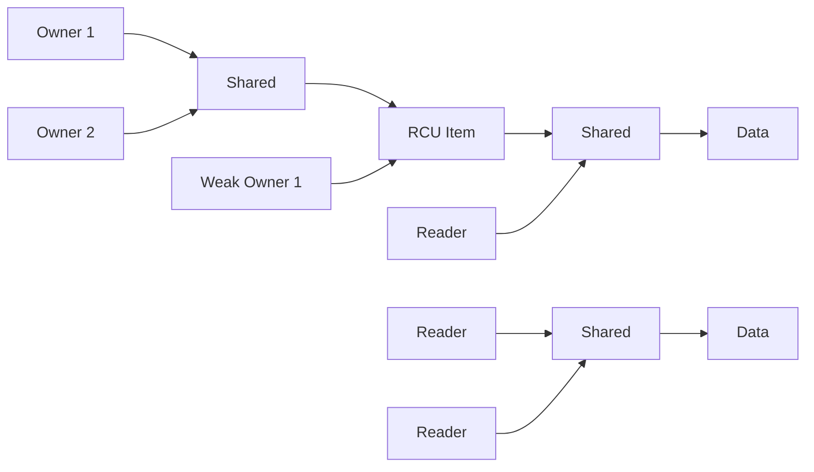

# RCU

Le RCU est un idiome utilisé dans des contextes de multithreading afin de gérer la mise à jour d'objets.

Les données suivantes présentent les résultats des 4 implémentations du RCU. Elles sont à interpréter avec prudence pour ces raisons :

* 1 seule donnée mise en concurrence : les mutex sont soumis à un fort effet de concurrence.
* Lecture extrêmement courte : dans une application réelle, un objet nécessitant un RCU est d'une certaine complexité. Ici la donnée peut être substituée par un `atomic<int>`. Les readers entrent en contention de manière plus fréquente.
* Mise à jour simple : même cas que pour les reader. Visible sur le transfert de latence entre les readers (tests Re7 - Wr1) et les writers (tests Re1 - Wr7).
* Contentions : les tests de contentions réalisent beaucoup plus d'opérations que celles reportées. Pour le test `Simple Starved Re7 - Wr1`, 1,4M d'opérations de lecture sont requises, mas en extrapolant la moyenne de temps requise pour ces opérations, environ 6,4M d'opérations ont été réalisées durant les 238ms nécessaires au writer.

|                          | 1     | 2       | 3       | 4       | 5       | 6       | 7       | 8       |
| ------------------------ | ----- | ------- | ------- | ------- | ------- | ------- | ------- | ------- |
| Simple Re7 - Wr1         |  48ms |    48ms |    43ms |    42ms |    44ms |    51ms |    49ms |    61ms |
| Simple Re4 - Wr4         |  26ms |    24ms |    23ms |    22ms |   101ms |    94ms |   106ms |   105ms |
| Simple Re1 - Wr7         |   5ms |   182ms |   186ms |   186ms |   187ms |   184ms |   184ms |   186ms |
| Shared Re7 - Wr1         |  93ms |    95ms |    95ms |    94ms |    96ms |    95ms |    95ms |   106ms |
| Shared Re4 - Wr4         |  27ms |    26ms |    26ms |    27ms |   109ms |   113ms |    99ms |   110ms |
| Shared Re1 - Wr7         |   3ms |   186ms |   178ms |   183ms |   183ms |   184ms |   185ms |   179ms |
| Atomic Re7 - Wr1         | 142ms |   147ms |   149ms |   149ms |   149ms |   149ms |   146ms |   167ms |
| Atomic Re4 - Wr4         |  95ms |    95ms |    93ms |    93ms |   207ms |   210ms |   190ms |   193ms |
| Atomic Re1 - Wr7         |   7ms |   224ms |   231ms |   231ms |   204ms |   219ms |   230ms |   223ms |
| Spin Re7 - Wr1           | 394ms |   362ms |   377ms |   394ms |   392ms |   393ms |   394ms |   395ms |
| Spin Re4 - Wr4           | 142ms |   145ms |   127ms |   147ms |   214ms |   213ms |   212ms |   216ms |
| Spin Re1 - Wr7           |  11ms |   177ms |   179ms |   180ms |   179ms |   163ms |   173ms |   178ms |
| Simple Starved Re7 - Wr1 |  56ms |    41ms |    65ms |    55ms |    58ms |    54ms |    39ms |   238ms |
| Simple Starved Re4 - Wr4 |  30ms |    18ms |    31ms |    27ms |  2154ms |  2341ms |  2150ms |  2011ms |
| Simple Starved Re1 - Wr7 |   6ms |  4344ms |  4438ms |  4437ms |  4079ms |  4575ms |  3598ms |  4561ms |
| Shared Starved Re7 - Wr1 |  94ms |    93ms |    91ms |    93ms |    94ms |    89ms |    89ms | 17065ms |
| Shared Starved Re4 - Wr4 |  20ms |    31ms |    21ms |    19ms | 45970ms | 43605ms | 39262ms | 45348ms |
| Shared Starved Re1 - Wr7 |   3ms | 13468ms | 13469ms | 13367ms | 13420ms | 13425ms | 13110ms | 13223ms |
| Atomic Starved Re7 - Wr1 | 159ms |   158ms |   141ms |   143ms |   147ms |   134ms |   158ms |   792ms |
| Atomic Starved Re4 - Wr4 | 102ms |   104ms |    98ms |   100ms |  3316ms |  3163ms |  3166ms |  3133ms |
| Atomic Starved Re1 - Wr7 |   6ms |  3189ms |  3183ms |  3331ms |  2883ms |  2912ms |  2960ms |  3235ms |
| Spin Starved Re7 - Wr1   | 334ms |   400ms |   404ms |   375ms |   377ms |   385ms |   419ms |   447ms |
| Spin Starved Re4 - Wr4   | 157ms |   160ms |   152ms |   140ms |   841ms |   874ms |   786ms |   834ms |
| Spin Starved Re1 - Wr7   |  11ms |   468ms |   465ms |   459ms |   477ms |   484ms |   482ms |   439ms |